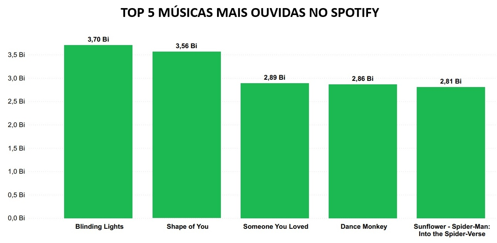
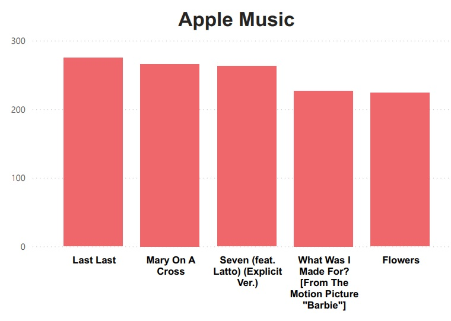
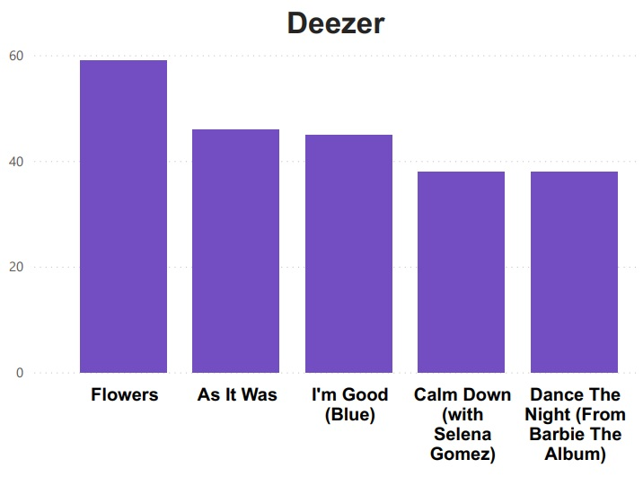
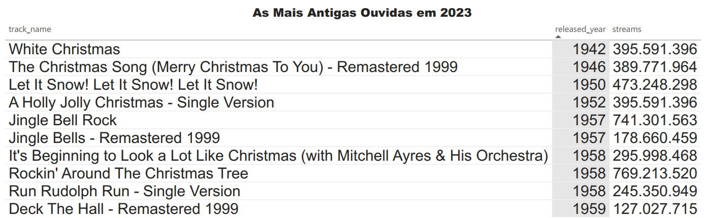

  
  <h1 style="font-size: 20px;"><b>LEITURA E ANÁLISE DE DADOS DO SPOTIFY</b></h1>

<h1 align="center">

</h1></h1>

<b>Módulo 4: Técnicas de Programação I </b> Projeto desenvolvido pelo grupo 5 da turma 1173 do programa <b>Santander Coders</b> 2024.1 em parceria com a <b>Ada Tech</b>

## Objetivos do Projeto
- Aplicar programação funcional (usando map, filter, reduce) no processamento de dados reais
- Desenvolver habilidades de manipulação de arquivos CSV com Streams
- Praticar a lógica e a análise de dados em um cenário realista

## Descrição do Projeto
O projeto foi desenvolvido com base em um arquivo CSV contendo dados da plataforma Spotify, com o objetivo de aplicar filtros específicos para extrair e analisar informações relevantes. Os filtros utilizados são:
- **Top 5 músicas mais ouvidas no Spotify:** Seleciona as cinco músicas com o maior número de reproduções na plataforma Spotify.
- **Top 5 destaques - Apple Music:** Identifica as cinco músicas mais destacadas na plataforma Apple Music.
- **Top 5 destaques - Deezer:** Seleciona as cinco músicas mais destacadas na plataforma Deezer.
- **Top 5 músicas mais antigas ouvidas em 2023:** Identifica as cinco músicas mais antigas que foram ouvidas em 2023.
- **Músicas mais tocadas no ano 2000:** Seleciona as músicas mais tocadas no ano 2000.
- **Artistas mais tocados em 2023:** Filtra os artistas mais tocados em 2023.
- **Total de reproduções - TOP 5 Spotify:** Calcula a soma de streams das cinco músicas mais escutadas no Spotify.

O projeto faz uso de técnicas de programação funcional, como map e filter, para processar os dados de forma eficiente. A manipulação dos arquivos CSV é feita com o uso de Streams, garantindo um processamento mais rápido e otimizado.

## Gráficos de Alguns dos Dados Filtrados

### TOP 5 MÚSICAS MAIS OUVIDAS NO SPOTIFY

### TOP 5 DESTAQUES - APPLE

### TOP 5 DESTAQUES - DEEZER

### MÚSICAS MAIS ANTIGAS OUVIDAS EM 2023

## Linguagem de Programação

## Ferramentas Utilizadas

## Integrantes
<table align="center" style="width: 80%;">
  <tr>
    <td align="center" style="width: 20%;">
       
      <b>Ana Laura Marques Rodrigues</b> 
      <a href="https://github.com/lauluah" target="_blank">GitHub</a>
    </td>
    <td align="center" style="width: 20%;">
       
      <b>Arthur Gabriel De Menezes Viana</b> 
      <a href="https://github.com/arthurgmv" target="_blank">GitHub</a>
    </td>
    <td align="center" style="width: 20%;">
       
      <b>Tainá Souza Peixoto</b> 
      <a href="https://github.com/peixotots" target="_blank">GitHub</a>
    </td>
  </tr>
</table>

